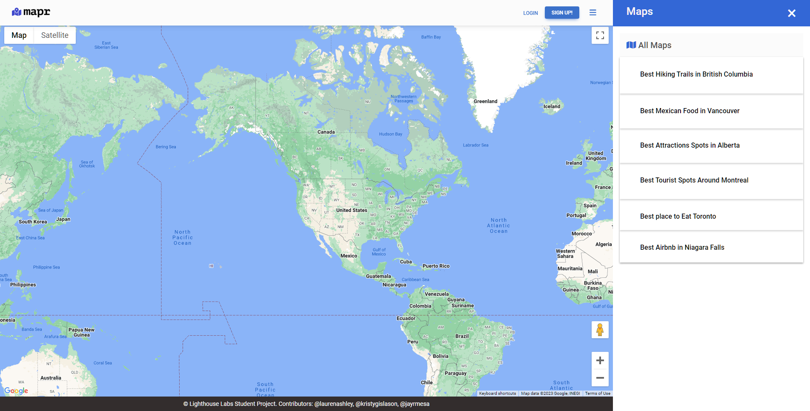
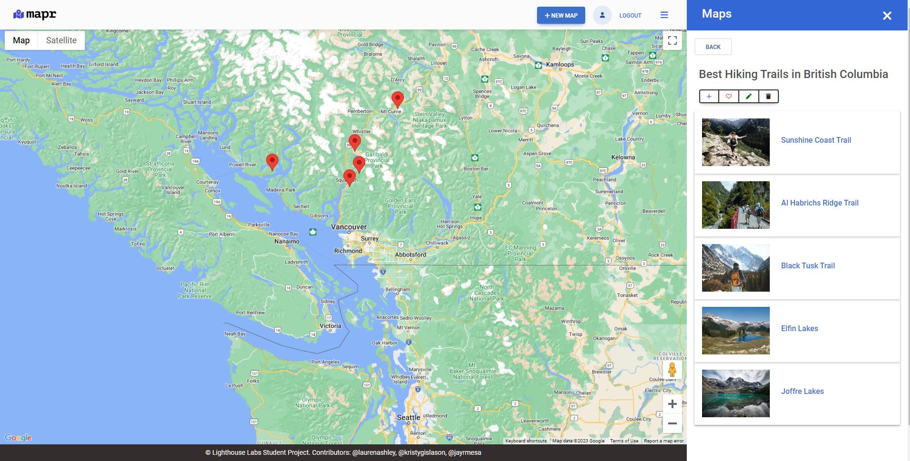
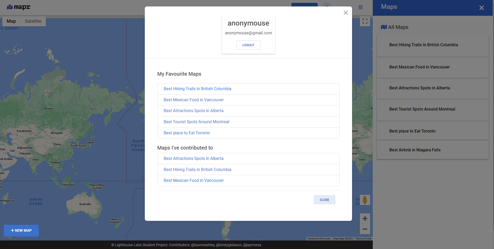

# Mapr

## Overview

A global map app that enables users to view, create, favorite and delete maps and pins. Any users may view all maps that have been created, but may only favorite, edit and delete a pin once logged in. 

## Screenshots of the Final Product

## Getting Started

1. Create the `.env` by using `.env.example` as a reference: `cp .env.example .env`
2. Update the .env file with your correct local information 
  - username: `labber` 
  - password: `labber` 
  - database: `midterm`
3. Install dependencies: `npm i`
4. Fix to binaries for sass: `npm rebuild node-sass`
5. Reset database: `npm run db:reset`
  - Check the db folder to see what gets created and seeded in the SDB
7. Run the server: `npm run local`
  - Note: nodemon is used, so you should not have to restart your server
8. Visit `http://localhost:8080/`
9. You may log in as a owner using demo@demo.com, with a password of 1234 but it should be loaded as soon as the user press login.

## Warnings & Tips

- Use the `npm run db:reset` command each time there is a change to the database schema or seeds. 
  - It runs through each of the files, in order, and executes them against the database. 
  - Note: you will lose all newly created (test) data each time this is run, since the schema files will tend to `DROP` the tables and recreate them.

## Dependencies

- [Node](https://docs.npmjs.com/downloading-and-installing-node-js-and-npm#overview) - Node 5.10.x or above
- [PG](https://www.npmjs.com/package/pg) - PG 6.x
- [bootstrap](https://www.npmjs.com/package/bootstrap) - bootstrap: ^5.1.3
- [chalk](https://www.npmjs.com/package/chalk) - ^2.4.2,
- [dotenv](https://www.npmjs.com/package/dotenv) - dotenv: ^2.0.0,
- [ejs](https://www.npmjs.com/package/ejs) - ^3.1.8,
- [Express](https://www.npmjs.com/package/express) - express: ^4.17.1,
- [morgan](https://www.npmjs.com/package/morgan) - ^1.9.1,
- [sass](https://www.npmjs.com/package/sass) - ^1.35.1

## Usage

Users will be able to see a list of available maps upon cliking the tab, users can see available points of pins with a title description and an image. The following features are available:
- Users can create, edit and delete maps and associated pins.
- Users can favorite a map.
- Users have profiles which indicate their favorites and maps they contributed to.

This application team project aim to deliver maps with pins that are accurate to the location, which allows users to collaboratively create maps which list multiple "points"

**_Midterm colllabprative project for Lighthouse Labs_**

**Main Contributors**: [Kristy Gislason](https://github.com/kgislason), [Lauren Ashley](https://github.com/laurenashley), [Jayr Mesa](https://github.com/jayrmesa)
